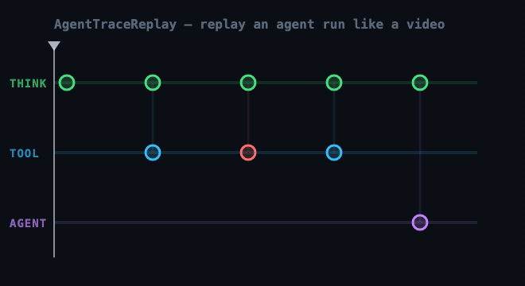

<div align="center">


# AgentTraceReplay

**Play back an agent run like a video.**

Drop an OpenTelemetry `gen_ai` trace and watch the agent think, call tools,
fail, and recover — step by step, on a scrubbable timeline.

<br />



<br />

[](./LICENSE)
[](https://zhejunliux.github.io/AgentTraceReplay/)
[](#privacy)
[](#privacy)

<samp>[Live demo](https://zhejunliux.github.io/AgentTraceReplay/) · [Quick start](#quick-start) · [Formats](#input-formats) · [Convert a run](#convert-your-run) · [Extend](#adding-a-format) · [Skills](#claude-code-skills) · [Privacy](#privacy)</samp>

**English** · [中文](./README.zh-CN.md)

</div>

---

Every other trace tool shows a **static** span tree. AgentTraceReplay is the one that
lets you *replay* the run — reasoning on the main line, tool calls branching off,
sub-agents on their own lane, failures and retries lighting up red exactly when
they happened.

## Quick start

```bash
npm install
npm run dev      # → http://localhost:5173 (loads a built-in sample)
```

Then **drop your own trace** (`.json`) onto the page. To ship it as a static site:

```bash
npm run build    # → dist/, deploy to GitHub Pages / Vercel / anywhere
```

<table>
<tr><td><kbd>Space</kbd></td><td>play / pause</td><td><kbd>←</kbd> <kbd>→</kbd></td><td>step back / forward</td></tr>
<tr><td><kbd>Esc</kbd></td><td>close inspector</td><td><kbd>click</kbd></td><td>seek to that moment</td></tr>
</table>

## Input formats

Drop any of these — the format is auto-detected, no config:

| Format | Detected by | Time axis |
| :----- | :---------- | :-------- |
| **OpenTelemetry `gen_ai`** | `resourceSpans[]` | real timestamps |
| **Chat messages** — OpenAI / Anthropic | `messages[]` with `role` | step axis |
| **Agent trajectory** — ReAct / DAComp | `trajectory[]` of `{ thought, action, observation }` | step axis |

> Anything else is parsed best-effort and flagged as *heuristic* in the UI.

## Convert your run

Using Claude Code, Codex, goose, or something else? Turn your run into a supported
shape:

```bash
node scripts/atif-to-otlp.mjs <run.json>          # ATIF → OTLP (real timestamps + tokens)
node scripts/trajectory-to-otlp.mjs <traj.json>   # ReAct / DAComp → OTLP
```

Or just **ask Claude Code** — the bundled [`/tracereplay`](./.claude/skills/tracereplay/SKILL.md)
skill handles the conversion for you.

## Adding a format

Every adapter is one pure function: `(json) => ReplayModel`.

Write one in [`src/model/`](./src/model/) that returns a `ReplayModel`
([`types.ts`](./src/model/types.ts)) and register it in
[`detect.ts`](./src/model/detect.ts). The UI depends only on that model — never on
the input shape. To scaffold one with Claude Code, run the
[`/add-adapter`](./.claude/skills/add-adapter/SKILL.md) skill.

## Claude Code skills

Bundled in [`.claude/skills/`](./.claude/skills/) — Claude Code picks these up
automatically in this repo:

| Skill | Use it to | For |
| :---- | :-------- | :-- |
| [`/tracereplay`](./.claude/skills/tracereplay/SKILL.md) | Convert one run into a droppable trace | End users |
| [`/add-adapter`](./.claude/skills/add-adapter/SKILL.md) | Scaffold native support for a new format | Contributors |

## Privacy

Parsing and rendering happen entirely in your browser. The production build ships a
Content-Security-Policy (`connect-src 'self'`) that blocks network egress at the
browser level — so the trace **cannot** be uploaded, even by accident.

## Status

Early MVP — timeline, playback, and span inspection work end to end. Built on the
(experimental) OpenTelemetry GenAI conventions. Contributions welcome.

<div align="center"><sub>Apache-2.0</sub></div>
